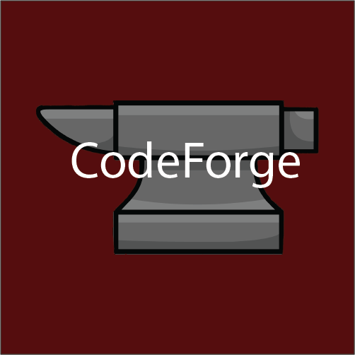

## About
CodeForge is a project focused on developing interactive games to enhance your math and English skills. Through engaging games like Hangman, Wordle, and more, we provide a fun and effective way to learn and practice.


## Game Descriptions
### 1. Hangman
* Input a single letter at a time to guess the word.
* You have a limited number of attempts, which depends on the chosen difficulty level.
* Choose between Easy, Medium, or Hard difficulty to customize your challenge.

### 2. Wordle
* Guess the correct word within a limited number of attempts.
* The `*` signifies a correct letter, but it is not in the correct place.
* The `_` signifies that the letter is not included in the word.
* Correctly guessed letters in the correct position remain visible in the word.

### 3. Word Scramble
* You will be given a scrambled word to guess.
* You have a limited number of incorrect guesses based on difficulty.
* The game ends when you guess the word or run out of attempts.

## Our Team
- [@BMGeorgiev23](https://github.com/BMGeorgiev23) - Scrum Trainer
- [@KGDaradjanov23](https://github.com/KGDaradjanov) - Frontend Developer
- [@nhdimitrov23](https://github.com/nhdimitrov23) - Backend Developer
- [@HAGrozdev23](https://github.com/Hristiyan1423) - Designer

## Documentation (soon to be included)
- [Presentation](./Documents/Code_forge_presentation.pptx)
- [Documentation]()

## Tools Used
     

### Download
To download our project, clone the repository using the following command:

```bash
git clone https://github.com/codingburgas/sprint-math-games-9th-grade-code-forge.git
